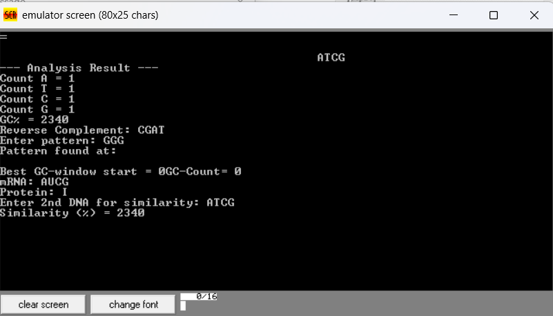

# 🧬 DNA & mRNA Analyzer – 8086 Assembly
A low-level bioinformatics toolkit written entirely in **8086 Assembly**, capable of processing biological sequences with precise manual memory and string handling.

---

## 📌 Features
- 🧪 **DNA Validation** (A, C, G, T only)
- 🔄 **Reverse Complement**
- 🎯 **Pattern Searching**
- 🔬 **GC Content Calculation**
- ✍️ **Transcription** (DNA → mRNA)
- 🧬 **Translation** (mRNA → Protein)
- 📊 **Sequence Similarity Percentage**
- 💾 Supports sequences up to **100 characters**

---

## 📂 Project Structure
/src
└── main.asm
/assets
└── coderun.png

---

## 🖼️ Preview


---

## 🚀 How It Works
### 1️⃣ Enter DNA Sequence
- The program validates the input
- Rejects invalid characters
- Stores data in memory buffers

### 2️⃣ Program Flow
- Counts nucleotides
- Computes GC%
- Generates reverse complement
- (Optional) Pattern search
- Finds GC-rich window (size 10)
- Transcribes to mRNA (T → U)
- Translates mRNA to protein using codon table
- Compares similarity with a second sequence

### 3️⃣ Output
- Printed results via DOS INT 21h services (EMU8086 / TASM / MASM)

---

## 🛠️ Technologies Used
- **Assembly 8086 / emu8086**
- DOS interrupts (INT 21h)
- Manual memory & buffer management
- Codon lookup logic implemented by comparisons

---

## 🏗️ How to Run
### ▶️ Using emu8086
1. Open `main.asm` in EMU8086
2. Assemble & run
3. Enter sequences when prompted

### ▶️ Using TASM (Windows)
```bash
tasm main.asm
tlink main.obj
main.exe
Enter DNA: ACGTACGTAC
Program prints:
--- Analysis Result ---
Count A = 3
Count T = 2
Count C = 3
Count G = 2
Reverse Complement: GTACGTACGT
mRNA: ACGUACGUAC
Protein: ...
